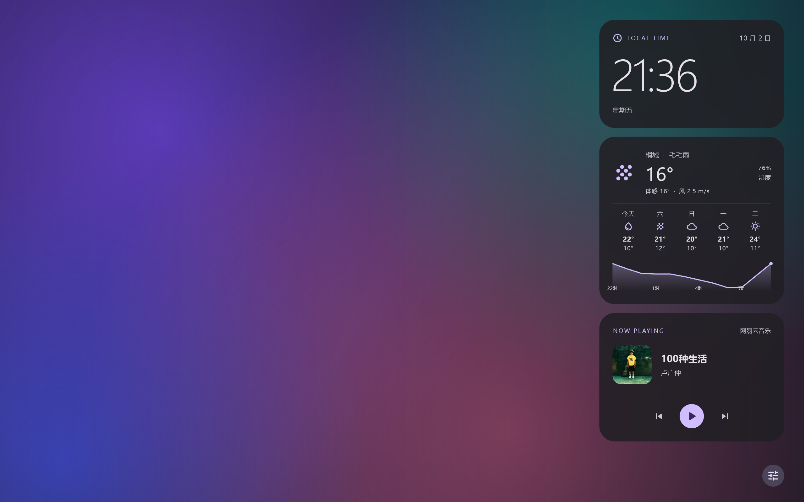
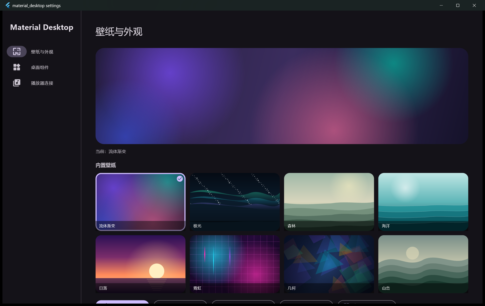
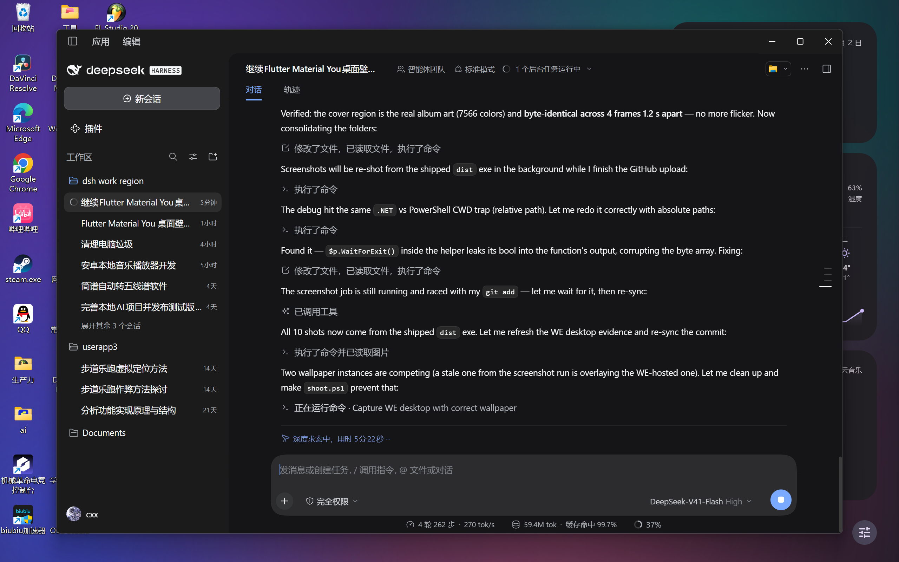
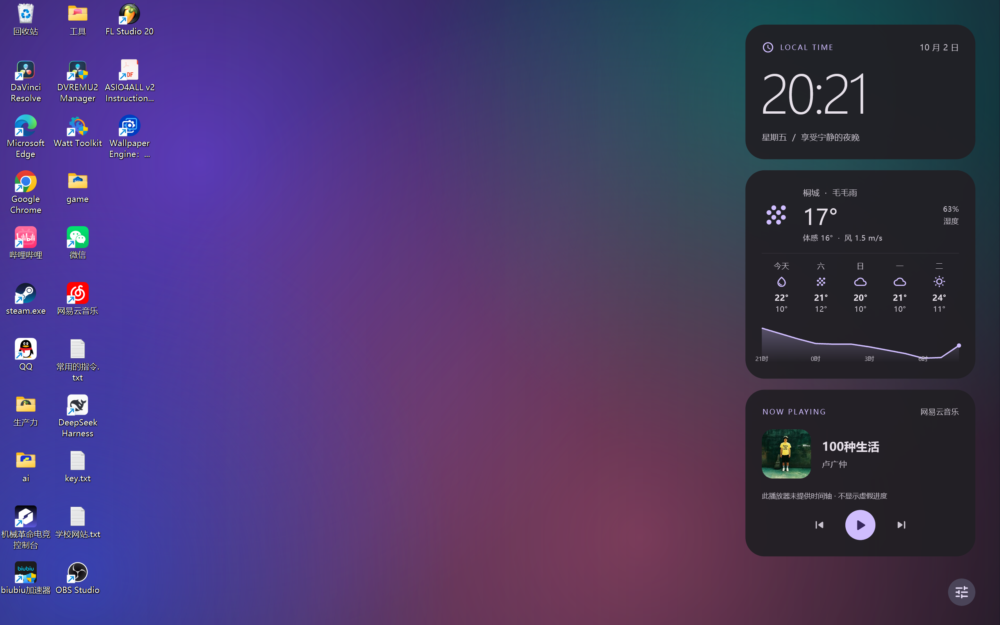

# Material Desktop · Flutter Material You 桌面壁纸 EXE

**English**: A Flutter (Windows) desktop wallpaper app. Launch it with no arguments and it
becomes the desktop wallpaper — a Material 3 clock / weather / now-playing stack over one of
8 procedurally drawn wallpapers, with Material You colors derived from the wallpaper.
`--settings` opens the control center. It can also be mounted as a Wallpaper Engine
*Application* wallpaper. MIT licensed.

一个 **Flutter (Windows) 桌面壁纸程序**：无参数启动就直接变成桌面壁纸 —— 右上角是
**时钟 / 天气 / 媒体播放**三块 Material 3 组件，背景是 **8 张可切换的内置壁纸**，
**换壁纸时整机主题色跟着变**（Material You 动态取色）。控制中心用同一个 EXE 的
`--settings` 模式，不会出现在壁纸画面里。

* 协议：[MIT](LICENSE) ｜ 更新记录：[CHANGELOG.md](CHANGELOG.md) ｜ 仓库：<https://github.com/chengxixian/material-you-desktop-wallpaper>
* 下载成品：见仓库的 [Releases](https://github.com/chengxixian/material-you-desktop-wallpaper/releases)（Windows x64 免安装 zip）
* **本地成品只放一个地方：`dist\`**（由 `tools\pack.ps1` 生成）——源码、脚本、截图、成品全在这一个工程目录里。

> 这是同目录系列里 HTML/CEF 版动态壁纸的**原生 Flutter 版本**：
> 界面不再画在 canvas 里，而是真正的 Flutter 桌面应用；可以独立运行，
> 也可以挂到 Wallpaper Engine 的「应用程序壁纸」上当动态壁纸。

| 壁纸模式（默认，全屏无边框） | 控制中心（`--settings`） |
| --- | --- |
|  |  |

---

## 一、跑起来

**成品在 `dist\`**（`tools\pack.ps1` 生成）：

```
dist\
├── material_desktop.exe + data\ + flutter_windows.dll   ← 绿色包（双击即用）
├── we-project\                                          ← Wallpaper Engine 工程（可选，见第六节）
└── material-you-desktop-wallpaper-<版本>-windows-x64.zip  ← 分享用的压缩包
```

### 运行方式

| 命令行 | 模式 | 说明 |
| --- | --- | --- |
| 无参数（或 `--desktop`） | **桌面组件模式**（默认） | 把壁纸交给 Windows 静态显示；右侧一条组件窗口钉在桌面层，**可以点** |
| `--settings` | 控制中心 | 普通窗口，按 DPI 取 1360x880 逻辑像素并居中 |
| `--settings --tab=N` | 控制中心指定页 | `0` 壁纸与外观 / `1` 桌面组件 / `2` 播放器连接 |
| `--wallpaper` | 全屏壁纸窗口 | 给 Wallpaper Engine 或临时预览用；**WE 壁纸收不到鼠标事件**，那里点不动 |

```powershell
Set-Location dist
.\material_desktop.exe                 # 桌面组件（推荐）
.\material_desktop.exe --settings      # 控制中心
```

* 桌面组件条右下角的**调节按钮**打开控制中心；控制中心里可以「退出桌面组件（还原原壁纸）」。
* 配置落盘在 `%LOCALAPPDATA%\MaterialDesktop\settings.json`，**进程每秒重读一次**：
  在控制中心改任何设置，组件立刻变，不用重启。
* 只接受已知配置字段，旧配置缺项用默认值补齐（前向兼容）。

### 配置项（`settings.json`）

| 键 | 默认 | 作用 |
| --- | --- | --- |
| `wallpaper` | `""` | 本地图片路径；非空时优先于内置壁纸 |
| `wallpaperId` | `mesh` | 内置壁纸 id：`mesh` `aurora` `forest` `ocean` `sunset` `neon` `geo` `mountain` |
| `rotate` / `rotateMinutes` | `false` / `30` | 定时轮换内置壁纸及间隔（只在用内置壁纸时生效） |
| `dark` | `true` | 深色主题 |
| `autoColor` | `true` | 跟随壁纸取色 |
| `seedColor` | `""` | 固定主题色 `#RRGGBB`（关闭 `autoColor` 后生效） |
| `highContrast` | `false` | Material 3 高对比度（`contrastLevel 0.5`） |
| `clock` / `clock24h` / `clockSeconds` | `true` / `true` / `false` | 时钟开关、24 小时制、显示秒 |
| `weather` / `weatherDays` / `weatherChart` | `true` ×3 | 天气开关、未来 5 天预报、未来 12 小时曲线 |
| `music` | `true` | 媒体组件开关 |
| `source` | `cloudmusic.exe` | 目标媒体会话（空 = 跟随系统当前播放器） |
| `city` / `latitude` / `longitude` | 北京 | 天气城市与坐标 |
| `panelOpacity` | `0.88` | 组件卡片背景不透明度（窗口本身是真透明的） |
| `acrylic` | `false` | 组件条用亚克力模糊（重开组件生效） |
| `autostart` | `false` | 开机自启（写 `HKCU\...\Run`） |
| `prevWallpaper` | `""` | 首次进入桌面模式时记下的原壁纸，退出时还原 |

---

## 二、功能说明

| 功能 | 行为 | 在哪里设置 |
| --- | --- | --- |
| **桌面组件模式** | Windows 静态壁纸（零渲染开销）+ 右侧透明组件条；组件条钉在桌面层（`Progman` 之上、普通窗口之下），**可直接点击**，桌面图标与其它区域照常使用 | 默认模式；控制中心 →「桌面组件」 |
| **8 张内置壁纸** | 程序化绘制（流体渐变 / 极光 / 森林 / 海洋 / 日落 / 霓虹 / 几何 / 山峦），零图片资源、离线可用、任意分辨率不糊；画廊缩略图为预渲染图片 | 控制中心 →「壁纸与外观」 |
| **本地图片壁纸** | 选图后作为壁纸；取色时按 112×112 解码后再量化（见第七节第 11 条） | 同上 →「选择本地壁纸」 |
| **Material You 取色** | 三级优先级：固定色 → 本地图片取色 → 内置壁纸自带 seed；取色失败回退，不留白 | 同上 →「壁纸自适应主题色」/ 固定主题色 |
| **主题** | 深色/浅色、高对比度、8 个预设种子色 | 同上 |
| **定时轮换** | 5/15/30/60/120 分钟轮换内置壁纸 | 同上 →「定时轮换内置壁纸」 |
| **时钟** | 大字时间 + 日期 + 星期；12/24 小时制、可显示秒（等宽数字不抖动） | 控制中心 →「桌面组件」 |
| **天气** | Open-Meteo（免 API Key）：当前温度/体感/湿度/风速、WMO 中文描述、未来 5 天、未来 12 小时温度曲线（自绘）；城市可搜索保存 | 同上 → 天气 |
| **媒体控制** | Windows GSMTC 真实元数据（歌名/歌手/专辑/封面/播放状态）；播放暂停、上一首、下一首、跳转按播放器**声明的能力**启停 | 控制中心 →「播放器连接」 |
| **开机自启 / 退出** | 自启开关；退出时还原原壁纸并结束组件进程 | 控制中心 →「桌面组件」 |

**不做假东西**：GSMTC 不提供音量、循环模式、音频频谱，界面就不显示这三类控件；
播放器不开放时间轴时**不画进度条**；天气取不到就显示可重试的提示，不生成演示数据。

---

## 三、Wallpaper Engine 接入（本机实测通过）

### 背景：Application 壁纸被下架了，但本机自用还能用

Wallpaper Engine **2.8.42** 起把「应用程序（Application）」类型壁纸从**创意工坊**下架
（有人用 exe 壁纸分发恶意程序），但官方说明**本机自用不受影响**：

* <https://videocardz.com/newz/wallpaper-engine-removes-exe-based-wallpapers-from-steam-workshop>
* 官方公告标题：*Wallpaper Engine 2.8.42 – Removal of Application Wallpapers from the Workshop*

本机 WE 版本：`D:\SteamLibrary\steamapps\common\wallpaper_engine`（2.8.42）。

### 挂载方式

WE 的 Application 工程 `project.json` 只有文件与标题（类型由 `.exe` 后缀推断）：

```json
{
	"file" : "material_desktop.exe",
	"general" : { "properties" : { "schemecolor" : { ... } } },
	"title" : "Material Desktop · Flutter 桌面小组件"
}
```

用脚本一条命令完成「打包进 WE 工程 + 挂载 + 验证 + 还原」：

```powershell
# 仓库根目录下执行（本机执行策略为 Restricted，.ps1 要用 ScriptBlock 方式载入）
$sb = [ScriptBlock]::Create([IO.File]::ReadAllText("tools\we-mount.ps1"))

& $sb -Action status    # 看 WE 进程 / 工程目录 / 当前壁纸 / 壁纸进程
& $sb -Action mount -ExeDir "build\windows\x64\runner\Release"
& $sb -Action restore   # 还原挂载前的壁纸（状态存在 tools\we-mount-state.json）
```

> WE 的安装目录默认按 `D:\SteamLibrary\steamapps\common\wallpaper_engine` 找，
> 装在别处就加 `-WeDir "<你的路径>"`。

`mount` 会：把 Release 包复制到 `projects\myprojects\material-desktop\`、写 `project.json`、
必要时拉起 WE、用官方命令行 `wallpaper64.exe -control openWallpaper -file <project.json>`
加载壁纸，最后打印壁纸进程与 `getWallpaper` 结果。

### 实测证据

```
血缘: material_desktop.exe(pid=5460) ← wallpaper64(pid=13772)
当前壁纸(config): .../projects/myprojects/material-desktop/material_desktop.exe
```

桌面上真实生效的样子（左：有窗口；右：显示桌面后）：

| 挂载后桌面 | 干净桌面 |
| --- | --- |
|  |  |

> WE 会把 exe 的窗口接管成**桌面层**窗口（所以用 `EnumWindows` 已经枚举不到它），
> 桌面图标照常显示在最上层，任务栏也不受影响。

---

## 四、构建 / 测试 / 截图

```powershell
git clone https://github.com/chengxixian/material-you-desktop-wallpaper.git
Set-Location material-you-desktop-wallpaper

flutter analyze          # No issues found!
flutter test             # 14 项断言全绿（启动模式、壁纸目录、天气解析、颜色解析、封面缓存、4 个控件测试）
flutter build windows --release

# 一键生成成品 dist\（绿色包 + WE 工程 + 分享 zip）
$sb = [ScriptBlock]::Create([IO.File]::ReadAllText("tools\pack.ps1")); & $sb

# 真实运行截图（写配置 → 启动 EXE → 等首帧 → PrintWindow 抓窗口位图）
# 本机执行策略 Restricted，所以要 ScriptBlock 载入
$sb = [ScriptBlock]::Create([IO.File]::ReadAllText("tools\shoot.ps1")); & $sb

# 验证「封面不闪」：连续抓帧比对封面区域哈希（覆盖 dist 里的成品 exe）
$sb = [ScriptBlock]::Create([IO.File]::ReadAllText("tools\check-artwork-flicker.ps1")); & $sb
```

> 截图 / 挂载脚本都是 PowerShell。抓图前会先把进程改成 **DPI-aware**，
> 否则在 125%/150%/175% 缩放的屏幕上只会截到窗口左上角一小块（详见第六节第 2 条）。

实测结果：

| 检查 | 结果 |
| --- | --- |
| `flutter analyze` | **No issues found**（0 error / 0 warning / 0 info） |
| `flutter test` | **14/14 通过** |
| `flutter build windows --release` | 通过，`material_desktop.exe` 243 KB（绿色包 27.5 MB，zip 11.4 MB） |
| 真实窗口截图 | 10 张，2560x1600 物理像素（本机 175% 缩放） |
| 封面不闪（真实桌面抓帧） | `tools/check-artwork-flicker.ps1`：4 帧间隔 1.2s，封面区域**哈希完全一致** |
| Wallpaper Engine 挂载 | 通过（进程血缘 + config.json + 桌面截图三重证据） |

---

## 五、工程结构

**本项目的所有东西都在这一个目录里**（源码 / 脚本 / 截图 / 成品），成品固定放 `dist\`：

```
material-you-desktop-wallpaper/
├── dist/                            ★ 成品（pack.ps1 生成；已在 .gitignore 里，发布走 Release）
│   ├── material_desktop.exe + data/ + flutter_windows.dll   绿色包：双击即壁纸
│   ├── we-project/                  Wallpaper Engine 应用程序壁纸工程（含 exe 副本）
│   └── material-you-desktop-wallpaper-<版本>-windows-x64.zip  分享用
├── lib/
│   ├── main.dart                    应用主体：状态、配置、主题、三块组件、控制中心、启动模式、封面缓存
│   └── src/
│       ├── wallpaper_catalog.dart   8 张内置壁纸（程序化绘制）+ seed 色目录
│       └── weather.dart             Open-Meteo 取数 / 解析 / WMO 代码映射（可离线单测）
├── test/widget_test.dart            14 项测试
├── windows/runner/
│   ├── native_bridge.cpp            MethodChannel 原生桥：GSMTC 媒体、配置读写、选图、窗口控制
│   └── CMakeLists.txt               加了 /utf-8（见「踩过的坑」4）
├── tools/
│   ├── pack.ps1                     生成 dist/（绿色包 + WE 工程 + zip）
│   ├── we-mount.ps1                 Wallpaper Engine 挂载 / 状态 / 还原（源 = dist/we-project）
│   ├── shoot.ps1                    一键出 10 张验收截图（写配置 → 抓图 → 还原配置）
│   ├── capture-window.ps1           真实窗口截图（含 DPI-aware 修正）
│   ├── check-artwork-flicker.ps1    连续抓帧比对封面区域，验证「封面不闪」
│   ├── push-via-git-api.ps1         本机 git push 走不通时，用 gh 的 Git Data API 推送
│   └── gsmtc-probe/                 不依赖 Flutter 的媒体会话探针（查播放器开放了哪些能力）
├── docs/ci.yml                      GitHub Actions 配置（放这里的原因见文件头注释）
├── shots/                           10 张真实运行截图（README 里引用的就是它们）
├── CHANGELOG.md / LICENSE / README.md
└── pubspec.yaml
```

原生桥（`material.desktop/native`）提供的方法：
`media` / `readConfig` / `writeConfig` / `pickWallpaper` / `settings` /
`wallpaper` / `settingsWindow` / `windowInfo` / `quitWallpaper`。

媒体查询必须跑在 **MTA** 线程（`std::async` 里做 WinRT `get()`），
不能在 Flutter 的 STA 平台上直接调 —— 否则会卡死或抛 apartment 错误。

---

## 六、踩过的坑（都在这台机器上复现过）

1. **Wallpaper Engine 不给 exe 传参数** → 启动模式改成「无参数 = 壁纸模式」，
   否则挂到 WE 上弹出来的是控制中心。
2. **DPI 陷阱：截图脚本自己骗了自己。** 用 DPI-unaware 的 PowerShell 抓图时，
   `GetWindowRect`/`GetSystemMetrics` 返回的是被虚拟化的尺寸
   （本机显示器 2560x1600 @175% → 1463x914），PrintWindow/`CopyFromScreen`
   于是只截到窗口**左上角一小块** —— 看上去就像「右上角三块组件根本没渲染」。
   窗口和 Flutter 视图其实一直是好的。修法：抓图前先 `SetProcessDPIAware()`。
   同理，**原生侧窗口尺寸不能用 `GetSystemMetrics(SM_CXSCREEN)`**，
   要用 `MonitorFromWindow` + `GetMonitorInfo(...).rcMonitor`（物理像素）。
3. **`AnimatedSwitcher` 给子节点的约束是 loose 的。** 换壁纸的交叉淡入包了一层
   AnimatedSwitcher 之后，`CustomPaint`（没有 child、也没写 `size`）按 `Size.zero`
   布局，结果是**整张壁纸都不画**，只剩 Scaffold 的黑底。修法：`size: Size.infinite`
   （图片则要 `width/height: double.infinity` + `BoxFit.cover`）。
4. **MSVC + 中文注释 = C4819。** 本机系统代码页 936，`.cpp` 里的 UTF-8 中文注释会被
   按 GBK 解码，注释里的字节吞掉后面的代码行（报一堆「未声明的标识符」），
   而 `warnings-as-errors` 让 C4819 直接变成构建失败。
   修法：`target_compile_options(... "/utf-8")`。
5. **读 WE 的 `config.json` 别用 `Get-Content`。** PowerShell 5.1 默认按 ANSI 解码，
   里面的中文用户名键（`Admin（无密码）`）会变乱码，`$json.$userKey` 直接取到 null；
   写回更会把用户的 WE 设置毁掉。用 `[IO.File]::ReadAllText`（UTF-8）读、
   要备份就**字节级复制**，改配置让 WE 自己改（`-control openWallpaper`）。
6. **`-control getWallpaper` 可能打印空**（WE 刚起来/版本差异），
   权威状态是 `config.json` 的 `selectedwallpapers.Monitor0.file`，拿它兜底。
7. **Flutter 默认窗口是 1280x720 物理像素**，在 175% 缩放的屏幕上只有
   731x411 逻辑像素，又小又挤。控制中心改成按 DPI 取 1360x880 逻辑像素并居中。
8. `flutter run -- --wallpaper` 这种写法会把 `--wallpaper` 当成 target 文件名，
   要传 Dart 参数得用 `--dart-entrypoint-args`。
9. **「音乐封面一直在闪」不是动画问题，是 `MemoryImage` 身份问题。**
   修之前原生桥**每秒都把封面字节回传一次**，Dart 侧每收到一次就 `new` 一个
   `Uint8List`；而 `MemoryImage` 的相等性看的是 **bytes 的 identity** ——
   于是 `Image` 每秒都被判定为新 provider，**每秒重新解码一次图片**，
   看上去封面就一直在闪（顺带每秒白传 100KB、白烧 CPU）。
   修法两条：① 原生只在**换歌那一次**回传字节，其余轮询只回 `artworkKey`
   （取图失败还会最多重试 3 次）；② Dart 侧用 `ArtworkCache` 缓存同一个
   `Uint8List` 实例。回归测试见 `test/widget_test.dart` 的「专辑封面缓存」组，
   实测验证见 `tools/check-artwork-flicker.ps1`（连续抓帧比对封面区域哈希）。
10. **PowerShell 5.1 没有 `?:` 三元运算符**，`$a ? 1 : 0` 会直接语法错误。
11. **「选完本地壁纸就卡死」= 给量化器喂了原图。** `ColorScheme.fromImageProvider`
    会把解码后图片的**每一个像素**交给 `QuantizerCelebi`。一张 6000x4000（2400 万像素）
    的照片实测要 2.7s CPU、并让进程常驻内存冲到 ~880MB；更大的图就是几分钟的假死。
    修法：`ResizeImage(FileImage(file), width: 112, height: 112)` —— 让**解码阶段**就缩到
    112x112（1.2 万像素）再取色，颜色结果不变，耗时降到毫秒级。
12. **控制中心 ~890MB 内存**：8 张内置壁纸的缩略图若用 `CustomPaint` 每帧重画
    （大半径径向渐变 + 光斑会不断产生离屏层），常驻内存会从 ~300MB 冲到 ~890MB。
    修法：启动后**预渲染成 PNG 缓存**，画廊/预览改用 `Image.memory`（实测回到 ~334MB）。
13. **PowerShell 的 `Set-Location` 不会改 .NET 的当前目录**：`[IO.File]::ReadAllBytes('相对路径')`
    会按进程 CWD（工作区根）解析而不是 PowerShell 当前位置 —— 用绝对路径。
    同理 `FindWindow($null,'标题')` 里的 `$null` 会被编组成**空字符串**而不是 NULL，
    必须写 `[NullString]::Value`，否则永远找不到窗口。
14. **函数里未捕获的表达式会污染返回值**：`Get-BlobBytes` 里 `$p.WaitForExit()` 返回 bool，
    不写 `$null = ...` 就会让函数返回 `@($true, <bytes>)`，后续 `ToBase64String` 拿到垃圾。

---

## 七、已知限制

* **媒体能力的上限来自 GSMTC**：没有音量、循环模式、频谱；不同播放器开放的
  控制项不同（网易云当前不开放时间轴/跳转），界面只显示播放器声明的能力。
* **天气需要联网**（Open-Meteo）；断网时显示「天气暂时不可用 · 点击重试」，
  不伪造数据。
* 内置壁纸是程序化绘制的矢量风格，不是照片；要照片就用「选择本地壁纸」。
* 壁纸模式是**无边框全屏窗口**，不是 `SetParent(WorkerW)`：
  独立运行时它盖住整个屏幕（所以完全看不到任务栏）。
  要「图标在壁纸上层」的桌面级效果，就用 Wallpaper Engine 挂载（见第三节）。
* 单显示器：`wallpaper` 只铺满窗口所在的那块显示器。
* 定时轮换只在「使用内置壁纸」时生效（选了本地图片时不轮换）。

---

## 八、截图索引

| 文件 | 内容 |
| --- | --- |
| `shots/01-settings-appearance.png` | 控制中心 · 壁纸与外观（8 张壁纸画廊、取色开关、固定主题色、轮换） |
| `shots/02-settings-widgets.png` | 控制中心 · 桌面组件（组件开关、时钟选项、天气选项、城市） |
| `shots/03-settings-player.png` | 控制中心 · 播放器连接（媒体会话选择、真实元数据） |
| `shots/04-wallpaper-mesh.png` | 壁纸模式 · 流体渐变（5 天预报 + 12 小时曲线） |
| `shots/05-wallpaper-neon.png` | 壁纸模式 · 霓虹（主题色随壁纸变粉） |
| `shots/06-wallpaper-ocean-light.png` | 壁纸模式 · 海洋 + 浅色主题 |
| `shots/07-wallpaper-aurora-12h-seconds.png` | 壁纸模式 · 极光 + 12 小时制 + 显示秒 + 高对比度 |
| `shots/08-wallpaper-sunset-minimal.png` | 壁纸窗口 · 日落 + 只留时钟（最简） |
| `shots/09-desktop-widgets.png` | **桌面组件模式的真实桌面**：静态壁纸 + 可点击组件条 + 图标照常可用 |

---

## 九、协议 / 反馈 / CI

* **协议**：[MIT](LICENSE) —— 随便用、随便改，保留版权声明即可。
* **反馈**：欢迎开 [Issue](https://github.com/chengxixian/material-you-desktop-wallpaper/issues)
  或 PR；提 bug 时如果能附上 `tools/gsmtc-probe` 的输出，媒体相关的问题会好定位得多。
* **CI**：`docs/ci.yml` 是一份标准的 Flutter analyze + test 配置，
  但**这里是 `docs/` 而不是 `.github/workflows/`**：推代码用的 token 没有 `workflow`
  scope，GitHub 会拒绝推送 workflow 文件。想启用就二选一：
  1. `gh auth refresh -h github.com -s workflow` 后把文件移到 `.github/workflows/ci.yml`；
  2. 直接在 GitHub 网页上新建 `.github/workflows/ci.yml`，把内容粘进去。
* **版本**：当前 `0.2.0`（见 [CHANGELOG.md](CHANGELOG.md)）。
